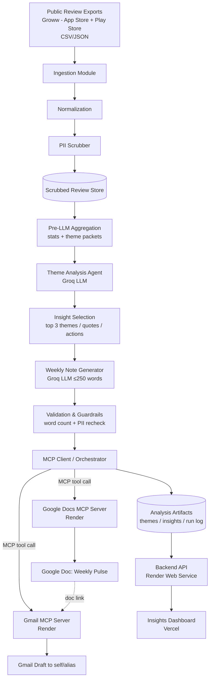
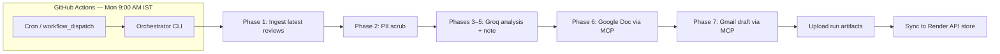
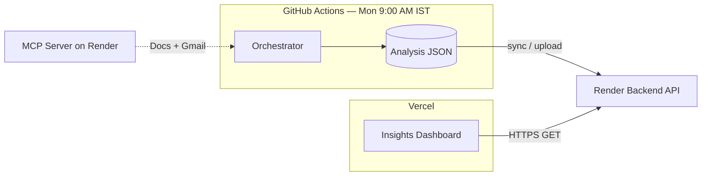
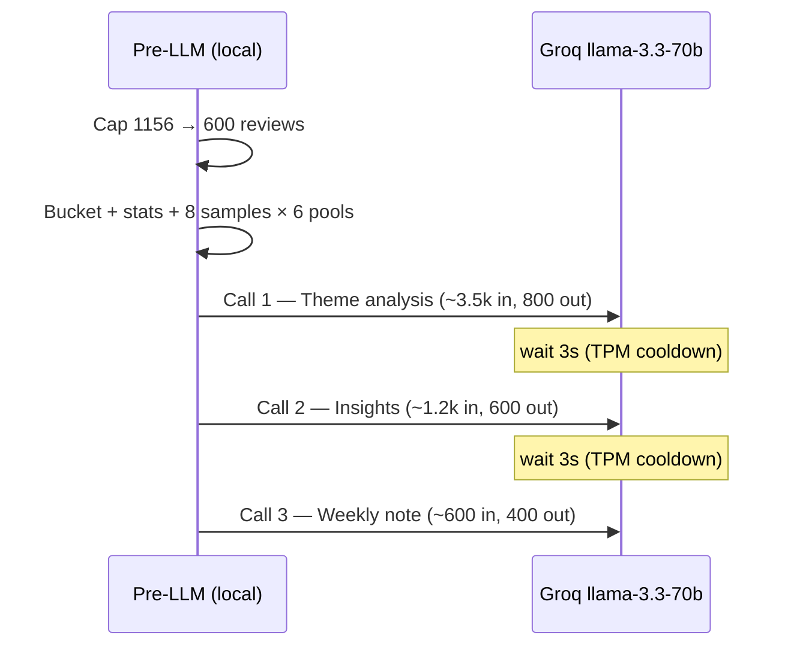

# Architecture — Groww Review Pulse AI Agent (MCP-based)

## 1. Purpose
An AI agent that imports recent **App Store + Play Store reviews of Groww (Stocks, Mutual Funds & Gold)**, groups them into themes, generates a one-page weekly pulse (top 3 themes, 3 real quotes, 3 action ideas, ≤250 words, no PII), writes it to **Google Docs**, creates a **Gmail draft**, and surfaces insights in a **browser dashboard** — all Google interactions go through **MCP servers**, not raw Google REST APIs.

The system is designed as a **pipeline of well-bounded stages** orchestrated by an MCP-aware agent, with a **Render-hosted API** and **Vercel-hosted dashboard** for production read access. Each stage has a single responsibility, a clear input/output contract, and a corresponding quality gate (see `eval.md`). This keeps the workflow auditable, testable, and easy to re-run weekly.

## 2. Design Principles
- **Tool-driven integration:** the agent reaches Google Docs and Gmail only through MCP tools, never provider SDKs/REST. This decouples business logic from vendor APIs and keeps the agent portable.
- **Privacy by construction:** PII is removed before anything reaches an LLM or an output artifact, so no downstream stage can leak it.
- **Deterministic boundaries, probabilistic core:** ingestion, filtering, validation, and delivery are deterministic; only theming and note-writing rely on the LLM, and their outputs are validated by deterministic checks.
- **Idempotent weekly runs:** a run for a given week produces one Doc and one draft; re-running is safe and overwrites/labels rather than duplicating uncontrollably.
- **Fail visible, fail safe:** every stage validates its inputs and surfaces clear errors; the Gmail step only ever creates a *draft* (never auto-sends).

## 3. High-Level Architecture



## 4. Logical Layers
1. **Data Layer** — raw exports → normalized, PII-safe review records.
2. **Intelligence Layer** — Groq LLM for theming, insight selection, and note authoring; fed by pre-aggregated packets, not raw bulk reviews.
3. **Guardrail Layer** — deterministic validation of constraints (≤250 words, no PII, exactly 3+3+3, ≤5 themes).
4. **Integration Layer** — MCP client + Google Docs/Gmail MCP servers (hosted on Render).
5. **Orchestration Layer** — sequences stages, manages retries, logging, run metadata, and **GitHub Actions** weekly scheduling (Monday 9:00 AM IST).
6. **Presentation Layer** — **Render** backend API + **Vercel** insights dashboard for read-only access to weekly pulse outputs.

## 5. Components

### 5.1 Ingestion Module
- Reads **public review exports only** (CSV/JSON) for the Groww app — no scraping behind logins.
- Accepts both stores and tags each record with its `source` (`app_store` | `play_store`).
- Extracts core fields: `rating`, `title`, `text`, `date`.
- Applies the **8–12 week** recency window.
- Tolerates messy inputs: skips/logs malformed rows instead of failing the whole run.

### 5.2 Normalization
- Maps differing export column names from the two stores into one unified schema.
- Standardizes dates, ratings (1–5), and encodings; trims and de-duplicates obvious repeats.
- Produces a clean, store-agnostic dataset for analysis.

### 5.3 PII Scrubber
- Detects and removes/masks usernames, emails, phone numbers, and IDs **before** any LLM call or artifact generation.
- Runs as a mandatory gate; nothing proceeds unless scrubbing has been applied and logged.
- Guarantees no PII can reach the analysis, the note, the Doc, or the Gmail draft.

### 5.4 Review Stores (Phase 1 → Phase 2 → Phase 3)
- **Normalized store** (`data/normalized/groww_reviews.json`) — output of Phase 1.
- **Scrubbed store** (`data/scrubbed/groww_reviews.json`) — output of Phase 2; **sole input to all LLM stages**.
- Lightweight JSON files with a store wrapper; enables re-runs without re-importing.

### 5.5 Pre-LLM Aggregation (deterministic, before Groq)

#### Input cap: 600 reviews
- Phase 3 operates on a **maximum of 600 reviews** from the scrubbed store (current corpus: 1,156 → drop 556 deterministically).
- **Selection rule:** sort by `date` descending (most recent first); keep the first 600; log dropped count in `data/analysis/run_metadata.json`.
- All stats and theme buckets are computed on this **600-review subset only**.

#### Why not send everything to Groq
- 600 reviews ≈ **~20k tokens** if sent raw — would consume **~20% of the daily token quota** in a single call and risk TPM limits.
- Pre-aggregation reduces Groq input to **~5–7k tokens total across all calls** (~5–7% of daily TPD).

#### Pre-pass steps (no API calls)
1. Load scrubbed store → apply **600-review cap**.
2. Compute dataset stats (rating mix, source split, date range).
3. Seed **5 Groww theme buckets** using keyword signals + rating severity.
4. Per bucket: `review_count`, `avg_rating`, `low_star_pct`, `source_split`.
5. Select **up to 8 representative reviews per bucket** (mix of low/high stars, diverse wording) — **≤48 samples total** across 6 pools (5 themes + general).
6. Route unmatched reviews into a **General experience** pool (stats only + 8 samples; Groq merges into nearest theme).
7. Estimate Call #1 token budget; if input exceeds **3,500 tokens**, reduce to **6 samples per bucket** and re-estimate before any API call.

#### Theme packets (Groq input unit)
Each packet contains **stats + ≤8 samples** — never the full 600 reviews:

```
{ theme_name, review_count, avg_rating, low_star_pct, source_split,
  samples: [{ id, rating, date, source, title, text }]  // max 8
}
```

### 5.6 Theme Analysis Agent (Groq LLM)
- **Provider:** [Groq](https://groq.com/) (OpenAI-compatible API).
- **Model:** `llama-3.3-70b-versatile` only (Phases 3–5 use one model for predictable limits).
- **Input:** 6 compact theme packets from §5.5 (stats + ≤8 samples each).
- **Output:** ≤5 themes with name, one-line summary, volume/sentiment signal (structured JSON, ≤800 tokens).
- Groq **refines** seed buckets (rename, merge overlaps, cap at 5) — does not cluster raw reviews.

### 5.7 Insight Selection
- Rank themes using a **severity score** (volume × low-star % × rating penalty) so painful high-volume issues surface first.
- Select **top 3** for the weekly note.
- Pick **3 representative PII-free quotes** (traceable to scrubbed reviews).
- Derive **3 concrete action ideas** tied to those themes.
- Can reuse Groq with structured JSON output, fed only the top theme packets.

### 5.8 Weekly Note Generator (Groq LLM)
- **Model:** `llama-3.3-70b-versatile`.
- Authors the scannable one-page note (**≤250 words**, ~350 output tokens max).
- Fixed structure: Top 3 themes → 3 quotes → 3 action ideas, with a short header (product + week range).
- **No separate fast model** in Phase 3–5 — keeps rate-limit planning on a single quota.

### 5.9 Validation & Guardrails
- Deterministic checks before delivery: word count ≤250, exactly 3 themes/quotes/actions, ≤5 themes overall, and a final PII re-scan.
- If a check fails, the run stops (or regenerates) rather than shipping a non-compliant artifact.

### 5.10 MCP Client / Orchestrator
- Coordinates the end-to-end pipeline and owns run state.
- **Single entry point** runs Phases 1–7 in order: ingest latest reviews → normalize → scrub → Groq analysis (3–4 calls) → Google Doc → Gmail draft.
- **Fresh data every run:** ingestion (Phase 1) executes at workflow start so each weekly pulse uses up-to-date public exports, not cached artifacts from a previous run.
- Connects to MCP servers, **discovers available tools**, validates required tools exist, and invokes them.
- Handles retries, timeouts, and structured error reporting; records a run log (inputs, counts, artifact links).

### 5.11 MCP Servers (Integration Layer)
- **Google Docs MCP server** → exposes tools to create a document and write the weekly note content.
- **Gmail MCP server** → exposes tools to create a **draft** email containing the note and/or the Doc link.
- **Hosting:** Saksham MCP server deployed on **Render** (e.g. `https://saksham-mcp-server-i1js.onrender.com`); separate from the Phase 9 insights API service.
- The agent calls these via the **Model Context Protocol**, keeping integration tool-driven, swappable, and consistent across the milestone.

### 5.12 Weekly Automation — GitHub Actions (Phase 8)
- **Scheduler:** [GitHub Actions](https://docs.github.com/en/actions) workflow in `.github/workflows/` triggers the full pipeline on a fixed weekly cadence.
- **Schedule:** every **Monday at 9:00 AM IST** — cron `30 3 * * 1` (03:30 UTC; IST = UTC+5:30).
- **Manual trigger:** `workflow_dispatch` so operators can re-run or test without waiting for Monday.
- **Secrets:** `GROQ_API_KEY`, `GOOGLE_DOC_ID`, `GMAIL_RECIPIENT`, and `MCP_PROFILE=remote` (plus any MCP-related config) stored as GitHub Actions repository secrets — never committed to the repo.
- **Artifacts:** workflow uploads run log and key outputs (`groq_usage.json`, `weekly_note.md`, `doc_delivery.json`, `draft_delivery.json`) for audit and debugging.
- **Why GitHub Actions:** no separate cron host; version-controlled schedule; built-in logs and secret management; aligns with a public repo or org CI pattern.



### 5.13 Backend API — Render (Phase 9)
- **Platform:** [Render](https://render.com) Web Service (Python/FastAPI or equivalent).
- **Role:** read-only HTTPS API over PII-safe analysis outputs — themes, insights, weekly note, run history, Doc/draft links.
- **Routes (illustrative):** `GET /health`, `GET /api/v1/pulse/latest`, `GET /api/v1/pulse/weeks`, `GET /api/v1/runs`.
- **Data source:** JSON artifacts from Phase 8 (synced from GitHub Actions artifacts, Render disk, or attached storage) — **never** raw review text.
- **Security:** CORS locked to Vercel dashboard origin(s); optional API key header for non-public deployments.
- **Ops:** health check path for Render auto-restart; env vars for `CORS_ORIGINS`, storage paths, and secrets; document cold-start behavior on free/starter tiers.

### 5.14 Insights Dashboard — Vercel (Phase 10)
- **Platform:** [Vercel](https://vercel.com) (Next.js or React SPA).
- **Role:** stakeholder-facing **insights dashboard** — latest pulse, theme cards, quotes, action ideas, run timeline, outbound Doc link.
- **Data:** fetches from Phase 9 Render API via `NEXT_PUBLIC_API_URL` (and optional auth token).
- **Views:** latest week hero, top-3 themes with volume/sentiment badges, quote blocks, action list, historical runs dropdown.
- **Deploy:** production on `main`; preview URLs per PR; environment-specific API base URLs (preview → staging API if used).
- **Constraints:** read-only v1; no PII fields rendered; graceful empty/loading/error states when API or weekly run is unavailable.



## 6. MCP Interaction Model
- **Discovery:** on startup the orchestrator lists tools from each MCP server and verifies the ones it needs (create doc, write content, create draft) are present.
- **Invocation:** the agent calls a tool with a structured payload (e.g., title + body for Docs; subject + recipient + body for the Gmail draft).
- **Result handling:** tool responses (e.g., document link, draft ID) are captured into run metadata and chained — the Doc link can be embedded in the Gmail draft.
- **Isolation:** because Docs/Gmail are behind MCP, the underlying provider/server can be replaced without touching the analysis or note-generation logic.

## 7. Data Flow (End to End)
1. **Scheduled or manual trigger** (GitHub Actions every Monday 9:00 AM IST, or local `groww-pulse` CLI).
2. Import **latest** public Groww review exports (8–12 weeks) from both stores — fresh ingestion each run.
3. Normalize into the unified schema.
4. Scrub PII (mandatory gate) → scrubbed store.
5. **Cap to 600 reviews** (most recent first) → pre-LLM aggregation → theme packets.
6. **Groq call #1** theme analysis → ≤5 themes.
7. **Groq call #2** insight selection → top 3 themes, 3 quotes, 3 actions.
8. **Groq call #3** weekly note generation → ≤250-word note.
9. Validate constraints + re-scan for PII.
10. Via MCP: append/write the Google Doc.
11. Via MCP: create the Gmail draft to self/alias (including the Doc link).
12. Persist run log and upload workflow artifacts (GitHub Actions).
13. Sync PII-safe artifacts to the **Render backend** store (Phase 9).
14. **Vercel dashboard** reads latest pulse and run history from the Render API (Phase 10).

## 8. Internal Review Schema
| Field   | Type   | Notes                              |
|---------|--------|------------------------------------|
| source  | enum   | `app_store` \| `play_store`        |
| rating  | int    | 1–5                                |
| title   | string | PII-scrubbed                       |
| text    | string | PII-scrubbed                       |
| date    | date   | within last 8–12 weeks             |

## 9. Weekly Note Structure (Output Contract)
- **Header:** "Groww Weekly Review Pulse — <week range>".
- **Top 3 Themes:** each with a one-line summary and rough volume/sentiment signal.
- **3 User Quotes:** short, real, PII-free snippets.
- **3 Action Ideas:** concrete next steps mapped to the themes.
- **Constraints:** ≤250 words, scannable (headings/bullets), no PII.

## 10. Error Handling & Reliability
- **Input errors:** malformed rows are skipped and counted; an empty/too-small dataset halts with a clear message.
- **LLM output errors:** non-conforming notes (length, missing sections) trigger a regenerate-or-fail path.
- **MCP errors:** missing tools, auth/connectivity, or tool failures produce actionable errors; transient failures are retried with backoff.
- **Safety:** Gmail step creates a draft only; no message is ever auto-sent.

## 11. Privacy & Compliance
- Public review exports only; no scraping behind logins.
- PII removed before LLM/output and re-checked before delivery.
- No usernames/emails/IDs in any artifact (Doc or draft).
- See `decision.md` (ADR-002, ADR-003, ADR-005) for the governing decisions.

## 12. Observability
- **Run log:** counts (imported, kept after window, scrubbed), selected themes, artifact links (Doc URL, draft ID), and pass/fail of each guardrail.
- **Traceability:** every quote in the note is traceable back to a source (scrubbed) review.
- **Dashboard (Phase 10):** Vercel UI surfaces latest run status, theme summaries, and historical weeks via the Render API — complements Gmail/Docs delivery for in-browser monitoring.

## 13. Technology Choices (summary)
- **Language/Runtime:** Python 3.11+ (see `decision.md` ADR-006).
- **LLM:** **Groq** — `llama-3.3-70b-versatile` for theme analysis and note drafting (see ADR-008).
- **Integration:** MCP servers for Google Docs and Gmail (no direct Google APIs); MCP server hosted on **Render**.
- **Storage:** JSON file stores for normalized, scrubbed, and analysis outputs.
- **Scheduling (Phase 8):** **GitHub Actions** — weekly cron every **Monday 9:00 AM IST** (`30 3 * * 1` UTC); `workflow_dispatch` for manual runs; repository secrets for API keys and delivery targets.
- **Backend (Phase 9):** **Render** Web Service — REST API exposing PII-safe insights and run metadata; CORS for Vercel origin.
- **Frontend (Phase 10):** **Vercel** — insights dashboard (Next.js recommended); `NEXT_PUBLIC_API_URL` points at Render backend.

## 14. Groq LLM Strategy (Phase 3–5)

### Model & rate limits (`llama-3.3-70b-versatile`)

| Limit | Quota | Our weekly target |
|-------|-------|-------------------|
| **RPM** — requests / minute | 30 | **3 calls** (sequential, 3s gap) |
| **RPD** — requests / day | 1,000 | **3–4 calls** (4th only if note retry) |
| **TPM** — tokens / minute | 12,000 | **≤6,000 per call** (stay under half) |
| **TPD** — tokens / day | 100,000 | **≤8,000 per weekly run** (~8% of quota) |

**Rules to stay within limits:**
- **Exactly 3 Groq calls** per weekly run (Phases 3, 4, 5). Optional **call #4** only if note validation fails (regenerate note, ≤1.2k tokens).
- Calls run **sequentially** with a **3-second pause** between them (TPM rolling-window safety).
- Each call input is **capped at ~3,500 tokens**; output capped via `max_tokens` in API (800 / 600 / 400).
- **Never** send the full 600-review corpus to Groq — only pre-aggregated packets.
- Log actual token usage per call in `data/analysis/groq_usage.json` for monitoring.

### Input cap: 600 reviews (from scrubbed store)

| Stage | Reviews |
|-------|---------|
| Scrubbed store (Phase 2 output) | 1,156 |
| **Phase 3 input cap** | **600** (most recent by date) |
| Dropped (logged, not sent to Groq) | 556 |

Stats and theme buckets reflect the **600-review subset only**. Groq never sees the full corpus — only **≤48 sample reviews** total (8 per bucket × 6 pools) plus per-bucket stats.

### Pre-LLM analysis (600-review subset)

| Metric | Value |
|--------|-------|
| Reviews analyzed (deterministic) | 600 |
| Est. tokens if all 600 sent raw | ~20k (**blocked** — would consume ~20% of daily TPD in one call and risk TPM) |
| Samples sent to Groq | ≤48 reviews + stats |
| Est. tokens all Groq calls combined | **~6–8k** (~6–8% of TPD) |

**Seed theme signals (on 600-review subset, proportional to current data):**

| Seed theme | ~Volume | Avg rating | Low-star (1–2★) | Signal |
|------------|---------|------------|-----------------|--------|
| Trading & orders | ~27% | 3.07 | 44% | Highest volume pain area |
| App UX & support | ~15% | 3.32 | 37% | Crashes, login, OTP, speed |
| Payments & withdrawals | ~10% | 2.42 | **62%** | **Most severe** |
| Mutual funds & SIP | ~8% | 3.72 | 28% | Mostly positive |
| Onboarding & KYC | ~3% | 2.45 | 58% | Smaller but painful |
| General / unassigned | ~37% | — | — | Groq merges into themes |

**Likely top 3 (severity-ranked):** Payments & withdrawals → Trading & orders → App UX & support.

### Call plan (token-budgeted)



| Call | Phase | Input (est.) | max_tokens | Purpose |
|------|-------|--------------|------------|---------|
| **#1** | 3 — Themes | ~3,000–3,500 | 800 | Refine ≤5 themes from 6 packets |
| **#2** | 4 — Insights | ~1,000–1,200 | 600 | Top 3 themes, 3 quotes, 3 actions (JSON) |
| **#3** | 5 — Note | ~500–700 | 400 | ≤250-word weekly pulse (markdown) |
| #4 (optional) | 5 — Retry | ~700 | 400 | Regenerate note if word-count/PII check fails |
| **Total** | | **~5–6k in** | **~1.8k out** | **~6–8k TPD per run** |

#### Limit headroom (why this plan is safe)

| Limit | Quota | Worst-case weekly run | Headroom |
|-------|-------|----------------------|----------|
| RPM | 30 | 3 calls (+1 retry) | 26+ spare per minute |
| RPD | 1,000 | 4 calls max | 996 spare per day |
| TPM | 12,000 | Call #1 peak ~4,300 tok (in+out) | ~7,700 spare in that minute |
| TPD | 100,000 | ~6–8k total | ~92k spare per day |

**TPM guard:** calls are **sequential** with a **3-second pause** between them so Call #1's peak clears the rolling minute window before Call #2 starts. Never parallelize Groq calls.

**Pre-call validation:** estimate input tokens locally (char count ÷ 4); abort before API if any call would exceed **3,500 input tokens** or **6,000 total tokens** (in+out) in a single request. If Call #1 input is too large, reduce samples per bucket (8→6) and re-estimate.

#### Call #1 input shape (~3.5k tokens)
- System prompt + JSON schema instruction (~400 tokens).
- Global stats for 600-review subset (~100 tokens).
- 6 theme packets × (stats ~50 + 8 samples × ~80 tokens) ≈ **~3,000 tokens**.

#### Call #2 input shape (~1.2k tokens)
- Top 3 theme summaries from Call #1 output (~300 tokens).
- 8 sample reviews per top theme (24 reviews max) ≈ **~900 tokens**.

#### Call #3 input shape (~600 tokens)
- Structured insights JSON from Call #2 only — no raw reviews.

### Recommended strategy (hybrid — pre-LLM + 3 Groq calls)

1. **Pre-LLM (local):** cap → 600 reviews → bucket → stats → 8 samples/pool → severity rank.
2. **Groq #1:** refine ≤5 themes (JSON).
3. **Groq #2:** top 3 + quotes + actions (JSON); quotes must be verbatim from samples.
4. **Groq #3:** weekly note (markdown); deterministic validation after.
5. **Guard:** if TPM/RPD error from Groq, exponential backoff (30s, 60s) — max 2 retries per call.

> Detailed rationale in `decision.md` (ADR-008, ADR-011). Phase breakdown in `implementationplan.md`; exit gates in `eval.md`.
